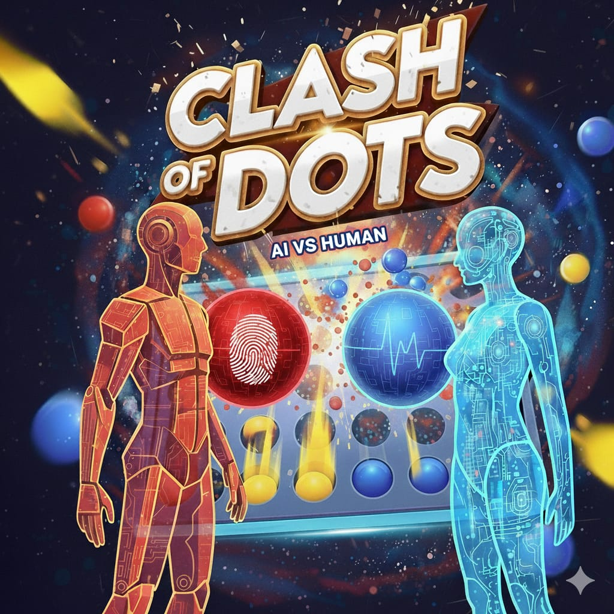

# Clash of Dots — World-Class Connect Four with AI

A modern, production-grade Connect Four strategy game featuring a multi-tiered Minimax AI with Alpha-Beta pruning, a 4-world campaign with boss battles, dynamic daily challenges, power-ups, cosmetic customization, and zero-latency procedural Web Audio synthesis.

<div align="center">
  
  <h3>Outsmart the AI. Master the Grid. Connect to Win.</h3>
</div>

---

## ✨ Features & Game Modes

### 🎮 Multiple Game Modes
- **Campaign Mode (4 Worlds • 24 Stages)**:
  - *World 1: Neon Nexus* — Grid fundamentals, move constraints, and Boss: **Vector Prime**.
  - *World 2: Magma Core* — Rock obstacles, the Bomb power-up, and Boss: **Titan Ignis**.
  - *World 3: Glacial Spire* — Freezing columns, defensive walls, and Boss: **Empress Cryo**.
  - *World 4: Quantum Void* — Symmetrical distortions, 8x8 expanded grids, and Final Boss: **Omni-Mind Singularity**.
  - 3-Star objectives per level based on speed, move efficiency, and tactical mastery.
- **Classic Mode (vs AI)**:
  - Selectable difficulty: *Recruit (Easy)*, *Tactician (Normal)*, *Master (Hard)*, and *Grandmaster (Expert)*.
  - Configurable board dimensions: Compact 6x6, Classic Standard 7x6, and Expanded 8x7.
- **Daily Challenge**:
  - Deterministic daily high-stakes puzzle rewarding 200 Coins and 50 Gems every single day.
- **Pass & Play (Local 2-Player)**:
  - Head-to-head match on the same device with alternating turns and custom badges.

### 💣 Tactical Power-Ups
- **Bomb Dot**: Drills to the foundation, obliterating a 3x3 zone and collapsing opponent towers via realistic gravity physics.
- **Laser Beam**: Vaporizes an entire targeted column in one clean sweep.
- **Freeze Column**: Locks an opponent's column for their next turn.

### 🎨 Armory Shop & Progression
- **Player Progression**: Earn XP, level up from Novice to Grandmaster, and earn currency.
- **Currencies**: In-game Coins and Gems earned purely through skilled play.
- **Disc Skins**: Classic Cyber Neon, Synthwave Sunset, Molten Core, Emerald Matrix, Royal Velvet, Cosmic Singularity, Glacial Crystal, and Championship Gold.
- **Board Themes**: Dark Carbon, Neon Cyberpunk, Volcanic Basalt, Glacial Glass, and Royal Obsidian.
- **Avatars**: Nexus Dot, Bot v1, Cyber Ninja, Fire Elemental, Cryo Sovereign, Quantum Overlord, and Dot Monarch.

### 🏆 Achievements & Analytics
- **20 Unlockable Achievements** with automatic claim tracking and coin/gem rewards.
- **Combat Analytics Dashboard** tracking total matches, win rate %, streaks, campaign stars, and daily challenges.

### 🔊 Audio & Visual Polish
- **Hybrid Audio Engine**: Zero-latency Web Audio API procedural sound synthesis for instant click, drop, explosion, and coin feedback.
- **Procedural Ambient BGM**: Relaxing, generative synthwave arpeggios with mute and volume sliders.
- **Visual FX Canvas**: Dynamic ambient cyber-mesh particles, realistic physics-based drop bounce, shockwave rings, and victory confetti blasts.
- **Accessibility & Customization**: High-contrast mode, screen-shake toggle, board size presets, and instant undo/hint tools.

---

## 🛠️ Architecture

```
Clash-of-Dots/
├── index.html          # Semantic HTML5 shell with modern game HUD and overlays
├── style.css           # Glassmorphism design system, 3D tactile board, and animations
├── script.js           # Master coordinator and initialization
├── js/
│   ├── audio.js        # Pure Web Audio API procedural synthesizer (zero asset latency)
│   ├── engine.js       # Core Connect Four logic, flexible grids, power-ups, gravity
│   ├── ai.js           # Minimax + Alpha-Beta pruning, move ordering, hint engine
│   ├── campaign.js     # 4 worlds, 24 levels, boss AI mechanics, star objectives
│   ├── challenges.js   # Deterministic daily challenges and tactical engine
│   ├── state.js        # Persistent state manager, progression, shop, achievements
│   ├── particles.js    # Canvas particle engine, drop shockwaves, confetti
│   └── ui.js           # Screen navigation, modals, HUD controller, toasts
├── logo.png            # High-res logo
└── logo2.jpg           # Square logo icon
```

---

## 🚀 Quick Start

1. Clone or download the repository:
```bash
git clone https://github.com/piyushb03/Clash-of-Dots.git
cd Clash-of-Dots
```

2. Open in your browser:
```bash
# Simply double-click index.html
# Or start a local server:
python -m http.server 8000
```
Visit `http://localhost:8000` in any modern web browser.

---

## 👤 Author

**Piyush Baghel**
- GitHub: [@piyushb03](https://github.com/piyushb03)
- LinkedIn: [Piyush Baghel](https://linkedin.com/in/piyush-baghel)

---

<div align="center">
  Made with ❤️ for Connect Four & AI Strategy Enthusiasts
</div>
